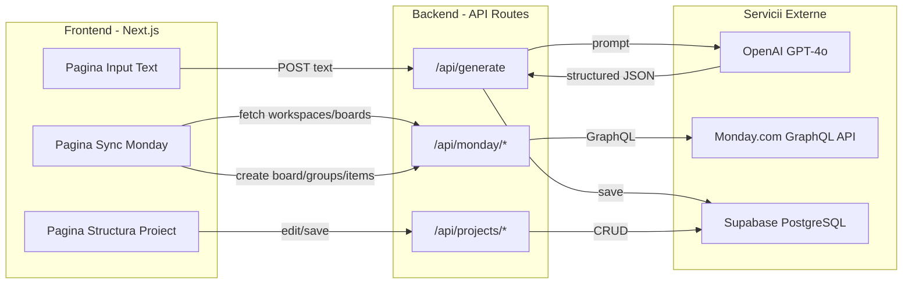
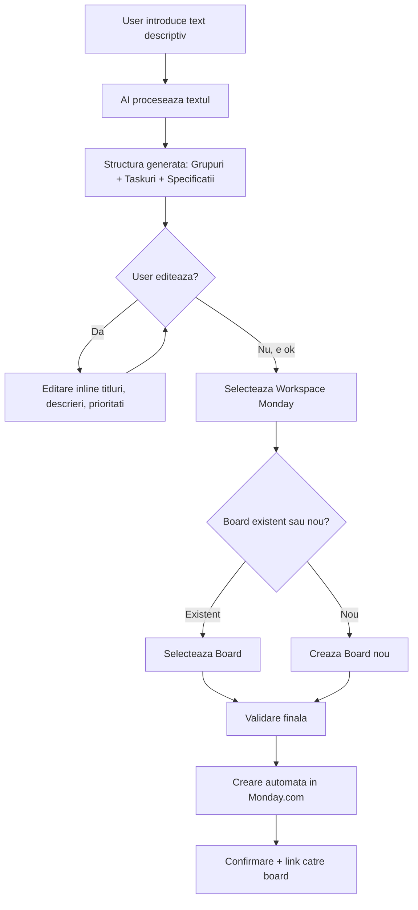

# Monday Project Generator - Plan de Implementare

## Arhitectura Generala




## Flow utilizator




## 1. Setup Proiect

- Initializare Next.js 16 cu `npx create-next-app@latest --api` (App Router, TypeScript, Tailwind CSS, ESLint)
- Instalare dependinte: `@supabase/supabase-js`, `@supabase/ssr`, `openai`, `zod`, `sonner`
- Setup `shadcn/ui` pentru componente UI
- Configurare `.env.local` cu cheile API (Monday, OpenAI, Supabase URL + anon key)
- Configurare `.gitignore` pentru `.env.local`

## 2. Schema Supabase

Creare tabele prin SQL direct in Supabase Dashboard sau prin migration:

```sql
-- Proiecte generate de AI
CREATE TABLE projects (
  id UUID PRIMARY KEY DEFAULT gen_random_uuid(),
  title TEXT NOT NULL,
  original_input TEXT NOT NULL,
  status TEXT NOT NULL DEFAULT 'draft',  -- draft | validated | synced
  monday_board_id TEXT,
  monday_workspace_id TEXT,
  created_at TIMESTAMPTZ NOT NULL DEFAULT NOW(),
  updated_at TIMESTAMPTZ NOT NULL DEFAULT NOW()
);

-- Grupuri din proiect (faze/categorii)
CREATE TABLE project_groups (
  id UUID PRIMARY KEY DEFAULT gen_random_uuid(),
  project_id UUID NOT NULL REFERENCES projects(id) ON DELETE CASCADE,
  title TEXT NOT NULL,
  color TEXT NOT NULL DEFAULT '#579BFC',
  position INT NOT NULL DEFAULT 0,
  monday_group_id TEXT,
  created_at TIMESTAMPTZ NOT NULL DEFAULT NOW()
);

-- Taskuri individuale
CREATE TABLE project_tasks (
  id UUID PRIMARY KEY DEFAULT gen_random_uuid(),
  group_id UUID NOT NULL REFERENCES project_groups(id) ON DELETE CASCADE,
  title TEXT NOT NULL,
  description TEXT,
  status TEXT NOT NULL DEFAULT 'pending',
  priority TEXT NOT NULL DEFAULT 'medium',
  estimated_hours NUMERIC,
  position INT NOT NULL DEFAULT 0,
  monday_item_id TEXT,
  created_at TIMESTAMPTZ NOT NULL DEFAULT NOW()
);
```

## 3. Structura Fisiere Principale

```
src/
  app/
    layout.tsx                  -- Layout global cu font, metadata, Toaster
    page.tsx                    -- Homepage: textarea input + buton "Genereaza"
    projects/
      [id]/
        page.tsx                -- Vizualizare + editare structura proiect
    api/
      generate/route.ts         -- POST: trimite text la OpenAI, salveaza in Supabase
      projects/[id]/route.ts    -- GET/PUT/DELETE proiect + grupuri + taskuri
      monday/
        workspaces/route.ts     -- GET: listeaza workspaces din Monday
        boards/route.ts         -- GET: listeaza boards dintr-un workspace
        sync/route.ts           -- POST: creeaza board/groups/items in Monday
  components/
    ProjectInput.tsx            -- Textarea + buton generare (homepage)
    ProjectStructure.tsx        -- Container principal structura proiect
    GroupCard.tsx                -- Card editabil pentru un grup
    TaskCard.tsx                -- Card editabil pentru un task
    MondaySelector.tsx          -- Dialog/modal selectare workspace + board
    Header.tsx                  -- Header navigare
  lib/
    openai.ts                   -- Helper OpenAI: system prompt + parsare raspuns
    monday.ts                   -- Helper Monday API: wrapper GraphQL queries
    supabase/
      client.ts                 -- createBrowserClient()
      server.ts                 -- createServerClient()
    types.ts                    -- Tipuri TypeScript comune
    schemas.ts                  -- Zod schemas pentru validare
```

## 4. Backend - API Routes

### `POST /api/generate` (AI Processing)

- Primeste `{ input: string }` din body
- Trimite la OpenAI cu system prompt structurat care forteaza output JSON
- Parseaza raspunsul cu Zod schema
- Salveaza in Supabase: proiect + grupuri + taskuri
- Returneaza proiectul complet cu ID

### `GET /api/projects/[id]`

- Fetch proiect cu toate grupurile si taskurile din Supabase
- Returneaza structura completa nested

### `PUT /api/projects/[id]`

- Update proiect (titlu, grupuri, taskuri) - pentru editarea de catre user
- Primeste structura completa, face upsert in Supabase

### `GET /api/monday/workspaces`

- GraphQL query catre Monday: `query { workspaces { id name is_default_workspace } }`
- Headers: `Authorization: <MONDAY_API_TOKEN>`, `API-Version: 2024-10`

### `GET /api/monday/boards?workspace_id=XXX`

- GraphQL query: `query { boards(workspace_ids: [XXX]) { id name } }`

### `POST /api/monday/sync`

- Primeste `{ projectId, workspaceId, boardId?, newBoardName? }`
- Daca `newBoardName`: creeaza board cu `create_board(empty: true, workspace_id, board_kind: public, board_name)`
- Itereaza grupurile: `create_group(board_id, group_name, group_color)`
- Itereaza taskurile din fiecare grup: `create_item(board_id, group_id, item_name)`
- Salveaza ID-urile Monday in Supabase (monday_board_id, monday_group_id, monday_item_id)
- Updateaza status proiect la "synced"

## 5. Frontend - Componente UI

### Homepage (`page.tsx`)

- Textarea centrala mare cu placeholder descriptiv
- Buton "Genereaza Structura Proiect" cu loading state
- Lista ultimelor proiecte generate (din Supabase)

### Pagina Structura (`projects/[id]/page.tsx`)

- Header cu titlul proiectului (editabil)
- Lista de GroupCard-uri (expandable)
- In fiecare GroupCard: lista de TaskCard-uri
- Fiecare TaskCard: titlu, descriere, prioritate, ore estimate (editabile inline)
- Butoane: "+ Grup", "+ Task" in fiecare grup, stergere
- Sidebar/Modal `MondaySelector`: dropdown workspace, dropdown board sau input board nou
- Buton final "Valideaza si Creeaza in Monday" cu confirmare

### MondaySelector (dialog)

- Fetch workspaces la mount
- La selectare workspace, fetch boards
- Toggle: "Board existent" vs "Board nou"
- Buton "Sync" care apeleaza `/api/monday/sync`

## 6. Monday.com GraphQL Client

Wrapper in `lib/monday.ts` care face `fetch("https://api.monday.com/v2")` cu:

- Header `Authorization: <token>`
- Header `Content-Type: application/json`
- Header `API-Version: 2024-10`
- Functii: `getWorkspaces()`, `getBoards(workspaceId)`, `createBoard(...)`, `createGroup(...)`, `createItem(...)`

## 7. OpenAI Prompt Design

System prompt in `lib/openai.ts` care instruieste GPT-4o sa returneze JSON strict:

- Titlu proiect
- Array de grupuri, fiecare cu titlu, culoare, si array de taskuri
- Fiecare task cu: titlu, descriere detaliata (specificatii), prioritate (high/medium/low), ore estimate
- Folosire `response_format: { type: "json_object" }` pentru output garantat JSON
- Validare raspuns cu Zod schema inainte de salvare

## 8. Deploy Vercel

- Push pe GitHub
- Connect repo in Vercel Dashboard
- Setare environment variables in Vercel: `MONDAY_API_TOKEN`, `OPENAI_API_KEY`, `NEXT_PUBLIC_SUPABASE_URL`, `NEXT_PUBLIC_SUPABASE_ANON_KEY`
- Deploy automat

